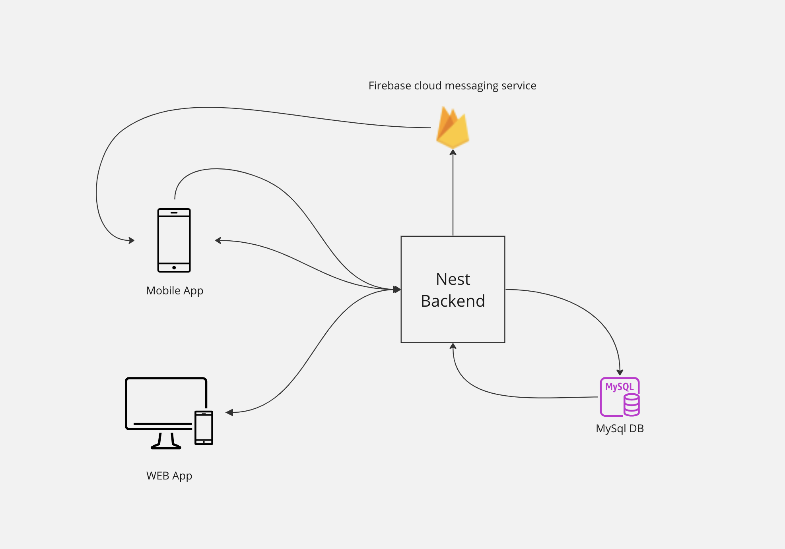
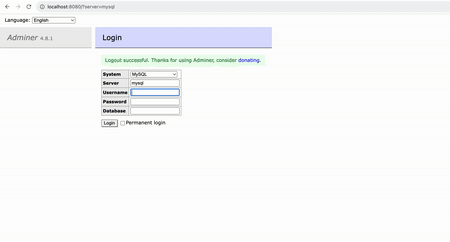

# Credentials management app

This repo is a workspace containing 3 interconnected apps which are:
- A React Native mobile app
- A React web app
- A Nest backend app

## Below are the features that are included in these apps:
### Major features include:
1. Remote locales, using i18next this app is fetching locales from a CDN.
2. Secure APIs, using RSA and JWT technologies
3. Firbase push notifications, to alert a user of app logins

### The mobile app:

 1. Secure account creation supporting 3 regions.
 2. Locale based translation supporting   English (US), Arabic (AE) and Arabic (SD).
 3. Secure app login using RSA encryption 
 4. Profile section with a JWT authenticated API, making sure user’s data are only available on secure APIs
 5. Push notifications to inform users of new logins on the web app. (This is an android only feature since iOS requires a developer account to register with APN)

### The web app:
1. Secure account creation supporting 3 regions.
2. Locale based translation supporting   English (US), Arabic (AE) and Arabic (SD)
3. Secure app login using RSA encryption 
4. Profile section with a JWT authenticated API, making sure user’s data are only available on secure APIs

### Nest backend:
1. User accounts creation
2. User authentication (Includes issuing JWT)
3. Profile API (Protected API using JWT authorization)
4. Firebase push notifications to mobile if a web login is detected.

## Project structure
Since the web and mobile apps share a lot of features, a decision was made to setup a this project is a monorepo using nx, below are the 2 main reasons:

### 1. Reusability
 Maximizing the reusability among the web and mobile app, enabled sharing a lot of features such as:
 1. Shared business logic
 2. Theming
 3. The network layer
 4. Type definitions
 5. The app state implementation
 6. Shared Utilities
### 2. Abstraction
Keeping the components libraries abstracted from the app enables for setting up an ecosystem of different apps and even storybooks to showcase and implement the same design concepts.
## Systems integration

# How to run the project
Below are the steps to run the project locally, I'll working on setting up a remote environment to deploy the apps as a show case.
## 1. System requirements
- NodeJs version **20.9.0** and above
- Yarn
- For react native setup, please follow the RN CLI setup guide here: https://reactnative.dev/docs/environment-setup
- Git
- Docker desktop

## 2. Installations
1. Clone the project 
		
		git clone https://github.com/true-hamid/credentials.git
2. Navigate to the project then install the dependencies:
		
		yarn install
	
## 3. Database Setup

1. Bringing the DB up and the DB adminer, on the root of the project, run the following command	
		
		docker-compose up
2. In your browser, open http://localhost:8080/
3. Input the details as shown below:
	- System: MySQL
	- Server: mysql
	- Username: root
	- Password: pass123
4. Creating the the credentials DB, 
	- DB name: credentials
	- Collation: utf8_unicode_520_ci
	- Flow the video below for help on this step
    
    
	 
## 3. Running the system
Run all of the following commands from the root of the project
### 1. The Nest App
Run the following command

	yarn nx run api:serve
### 2. The Web App

	yarn nx run web:serve	
To access the web app open http://localhost:4200/

### 3. The iOS App
	
	yarn nx run mobile:run-ios

### 4. The Android App
Before running the app, please , then run the following command:
	Prerequisite:
	1- Add local.properties file to apps/mobile/android with the following content

    sdk.dir = /Users/Path/To/Android/sdk
  Then run the following command
	
	yarn nx run mobile:run-android

