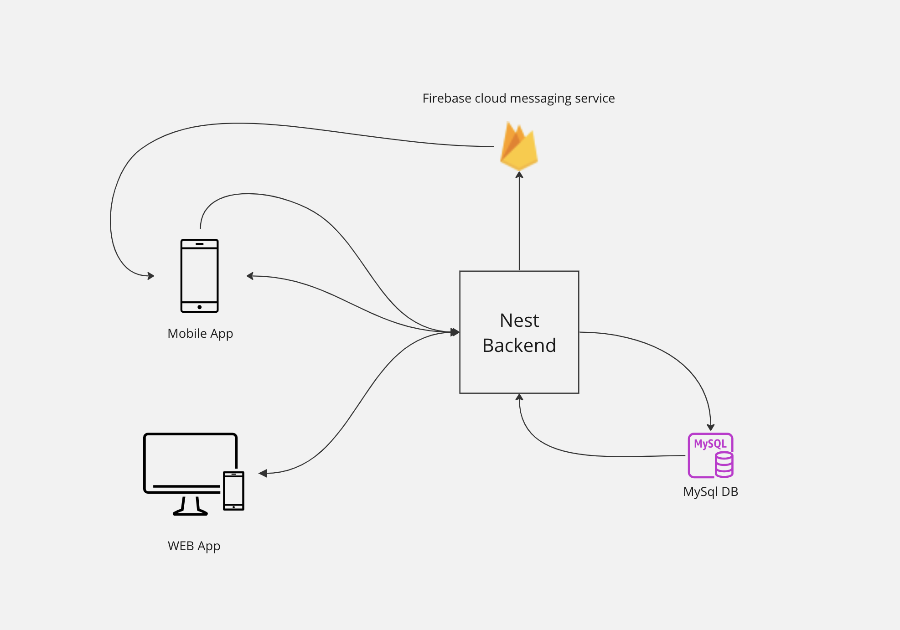

# Credentials management app

This repo is a workspace containing 3 interconnected apps which are:
- A React Native mobile app
- A React web app
- A Nest backend app

## Below are the features that are included in these apps:

### The mobile app:

 1. Secure account creation supporting 3 regions.
 2. Locale based translation supporting   English (US), Arabic (AE) and Arabic (SD), where the content is stored in a CDN (not locally as part of the project)
 3. Secure app login using RSA encryption 
 4. Profile section with a JWT authenticated API, making sure user’s data are only available on secure APIs
 5. Push notifications to inform users of new logins on the web app. (This is an android only feature since iOS requires a developer account to register with APN)

### The web app:
1. Secure account creation supporting 3 regions.
2. Locale based translation supporting   English (US), Arabic (AE) and Arabic (SD)
3. Secure app login using RSA      encryption 
4. Profile section with a JWT authenticated API, making sure user’s data are only available on secure APIs

### Nest backend
1. User accounts creation
2. User authentication (Includes issuing JWT)
3.  Profile API (Protected API through JWT
4.  Firebase push notifications to mobile if a web login is detected.

## Project structure:
Since the web and mobile apps share a lot of features, a decision was made to setup a this project is a monorepo using nx, below are the 2 main reasons:

### 1. Reusability
 Maximizing the reusability among the web and mobile app, enabled sharing a lot of features such as:
 1. Shared business logic
 2. Theming
 3. The network layer
 4. Type definitions
 5. The app state implementation
 6. Shared Utilities
### 2. Abstraction
Keeping the components libraries abstracted from the app enables for setting up an ecosystem of different apps and even storybooks to showcase and implement the same design concepts.
## Systems integration
